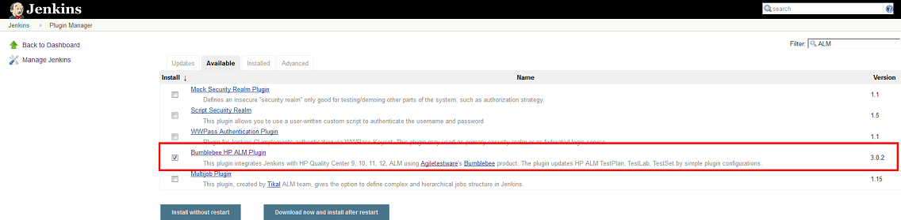
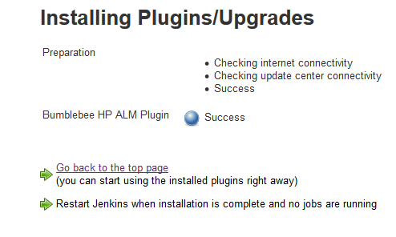
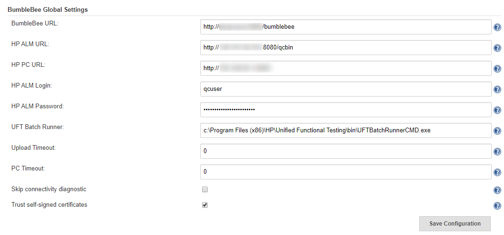
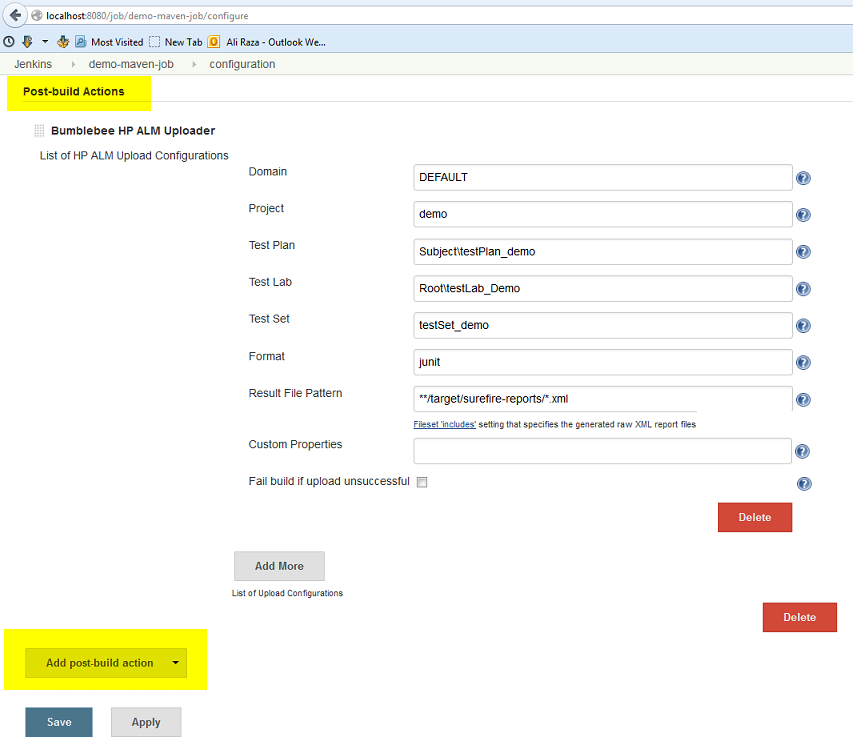
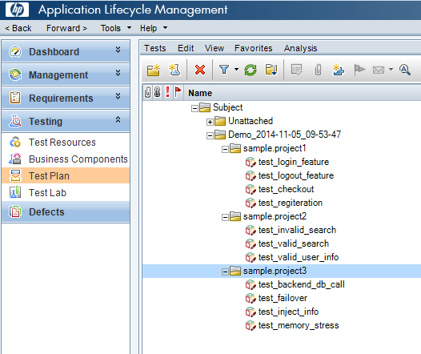
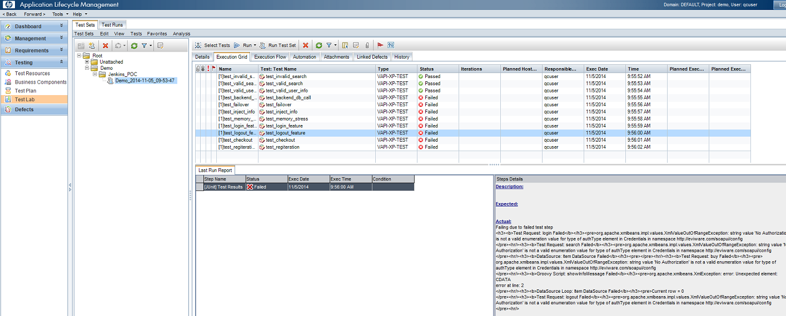
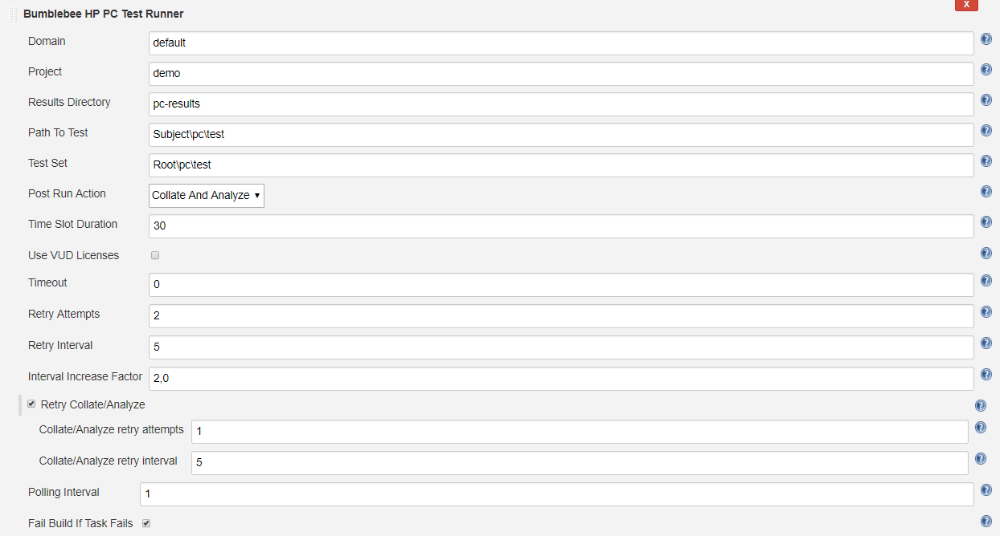
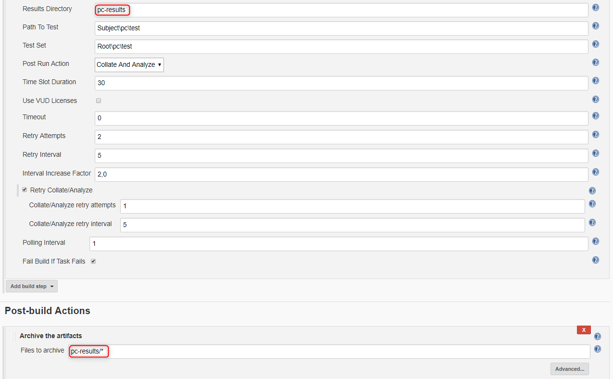

 

  
Bumblebee Jenkins plugin allows seamless integration of Jenkins jobs and build test results with [Micro Focus ALM](https://www.microfocus.com/en-us/products/alm-quality-center/overview) (former HP ALM) 11, 12, 14, 15. The plugin processes jenkins build data and sends it to the Bumblebee server for processing. Bumblebee automatically creates TestPlan, TestLab, TestSet, and TestRuns in [Micro Focus ALM](https://www.microfocus.com/en-us/products/alm-quality-center/overview).  
Bumblebee plugin is ideal for organizations who want to reflect the data from Jenkins into their Micro Focus ALM project. Organization use Bumblebee to show unit tests, Selenium test, Visual Studio tests, and various othertest frameworks that run in Jenkins into some Micro Focus ALM project. Bumblebee is a commercial product. For more details, please go to
<http://www.agiletestware.com/bumblebee>

[Changelog](./CHANGELOG.md)

Older versions of this plugin may not be safe to use. Please review the
following warnings before using an older version:

-   [Unconditionally disabled SSL/TLS certificate
    validation](https://jenkins.io/security/advisory/2019-10-16/#SECURITY-1481)
-   [Credentials stored in plain
    text](https://www.jenkins.io/security/advisory/2021-01-13/#SECURITY-2156)
    

## Why use Bumblebee plugin for Micro Focus ALM (former HP ALM)

The Bumblebee Jenkins plugin provides the ability to

-   Easily configure your Jenkins jobs to export their test results
    directly into HP ALM using the Bumblebee web service
-   No need to do anything on HP ALM. The plugin will create Test Plan,
    Test Labs, Test Sets, Test Run on the fly based on job
    configuration.
-   Allows unit tests, Selenium tests, or any other tests that you run
    in Jenkins to be reflected in HP ALM. Having all results in one
    place allows project managers to always get a clear picture of the
    project risks withing having to asks everyone for status.
-   Support JUnit, TestNG, TRX, Cucumber, Serenity, JBehave result
    formats. Can add any custom result formats as needed.
-   Trigger tests in HP ALM and report results back to Jenkins
-   Run local HP UFT tests
-   Start and monitor HP Performance Center tests execution

## Jenkins plugin Installation

Install the Bumblebee plugin for Jenkins using the Plugin manager.
Please restart Jenkins after installing or upgrade the plugin.

# Prerequisite

The Bumblebee Jenkins plugin communicates with the Bumblebee web service
which in turn communicates with HP ALM. You can download the Bumblebee
server from the [Agiletestware
website](http://www.agiletestware.com/bumblebee#download)

Detailed [user guide for installing Bumblebee
server](http://www.agiletestware.com/docs/bumblebee-docs/en/latest/setup/server-installation/).

## Bumblebee Global Configuration

Configure the Bumblebee URL, HP ALM URL, username, and password.

## Uploading test framework reports to HP ALM

Add the Bumblebee post build step in your job configuration. Specify ALM
TestPlan and TestLab details. Bumblebee will automatically collect,
parse, and insert test results in HP ALM.

Please refer to [the documentation for
details](https://www.agiletestware.com/docs/bumblebee-docs/en/latest/ci-integration/jenkins/#-export-tests-results)

## HP ALM Results

## Running HP ALM tests from Jenkins

Bumblebee's Jenkins build step allows you to run HP ALM TestSets
directly from Jenkins and view the results in both Jenkins and HP ALM.

 **Pre-Requisites for running HP ALM tests from Jenkins**

-   Job must run on the Jenkins agent installed on Windows machine
-   Jenkins agent must have launch method: Launch agent agents via Java
    Web Start
-   Jenkins agent must NOT run as windows service
-   Appropriate version of HP ALM Connectivity Tool must be installed on
    Jenkins agent machine. Tool is available at
    `http://your_alm_server_and_port/qcbin/PlugIns/TDConnectivity/TDConnect.exe`
-   Appropriate version of HP ALM Client must be installed on Jenkins
    agent machine. Available
    at `http://your_alm_server_and_port/qcbin/start_a.jsp?common=true`

To run test set from Jenkins you need to
add `Bumblebee HP ALM Test Set Runner` build step to your build
configuration

 

| Field                   | Description                                                                                                                                                                                                                                                                              |
|-------------------------|------------------------------------------------------------------------------------------------------------------------------------------------------------------------------------------------------------------------------------------------------------------------------------------|
| Domain                  | The name of HP ALM domain                                                                                                                                                                                                                                                                |
| Project                 | The name of HP ALM project                                                                                                                                                                                                                                                               |
| Test Sets               | A list of test sets to execute. Each test set path must start with new,line. Patch must start with Root and contains full path to the test set,in HP ALM TestLab. E.g. Root\\folder1\\testset1, where Root\\folder1 is,TestLab folder and folder1 is the name of the test set to execute |
| Run Mode                | How to run test sets. Possible values: LOCAL - run all tests on agent's,machine, SCHEDULED - run tests on planned host, REMOTE - run on remote,host                                                                                                                                      |
| Run Host                | The name of host on which tests shall be run. May be blank if Run Mode is LOCAL or SCHEDULED                                                                                                                                                                                             |
| JUnit Results Directory | Directory where JUnit-like execution reports will be placed. If it does not exist, Bumblebee will create it                                                                                                                                                                              |
| Timeout                 | The number of minutes to wait for test sets execution. 0 means wait indefinitely.                                                                                                                                                                                                        |

  

When Jenkins runs Bumblebee HP ALM Test Set Runner step it connects to
HP ALM server and triggers specified test sets.

Here is an example of build log produced by Bumblebee:

  

 

  

Bumblebee HP ALM Test Set Runner puts results of test execution as a
simple JUnit report which can be then published
using `Publish JUnit test result report` step

## Running local Micro Focus UFT tests directly in Jenkins

Bumblebee allows you to run local [Micro Focus Unified Functional
Testing](https://www.microfocus.com/en-us/products/uft-one/overview) tests directly from
Jenkins and reports results back to Jenkins.

### Prerequisites

-   Bumblebee server v4.1.0 or higher
-   Jenkins agent runs on Windows machine and have appropriate [Micro Focus Unified Functional Testing](https://www.microfocus.com/en-us/products/uft-one/overview) version installed.
    Please see UFT requirements for a particular version of OS and other
    software.
-   Jenkins agent must run as a console application (not as a windows
    service)
-   UFT Batch Runner property of Global Configuration or UFT\_RUNNER
    environment variable on agent must be set

To override path to UFT Batch Runner, defined in the Global
Configuration, you need to set a UFT\_RUNNER environment variable on a
Jenkins agent.

To set a value to UFT\_RUNNER environment variable of Jenkins agent:

-   Open Jenkins agent configuration page
-   Check "Environment variables" checkbox
-   Add a new variable and type "UFT\_RUNNER" as "Name" and path to UFT
    Batch Runner on that agent as a "Value"
-   Click on "Save" button

  

### Adding and configuring "Bumblebee Local UFT Test Runner" build step

To add a new "Bumblebee Local UFT Test Runner" build step, just add a
new build step in Jenkins build configuration with name **"Bumblebee:
Run local UFT tests"**.

**"Bumblebee Local UFT Test Runner"** build step has the following
configuration parameters:

-   Test Path - the path to a test folder or test batch file (.mtb)
    which shall be executed
-   Results Directory - directory inside your project where Bumblebee
    put JUnit-like execution reports. If it does not exist, Bumblebee
    will create it automatically.

**Note: If you use .mtb file from GIT repository, you need to make sure
paths to tests are correct and point to tests in build directory. You
can use windows batch script for this.**

Bumblebee UFT step puts results of test execution as a simple JUnit
report into folder defined by "Results Directory".  
These reports can be then published using Publish JUnit test result
report Post-build step.  
Please note that it shall be configured to scan the output directory of
Bumblebee UFT task.

  

When Jenkins runs Bumblebee UFT step, it will trigger local HP UFT Batch
runner and record its output:

### Checking build report

 Bumblebee UFT step captures results of test execution and produces a
simple JUnit report which are then attached to the build report and can
be seen on "Test Results" page:

For failed tests, report contains an error message reported by UFT:

UFT also produces detailed reports with description of all steps,
screenshots, etc...  
You can setup Jenkins to capture those results as build artifacts and
attach them to a build results.  
To do that, you just need to add "Archive artifacts" Post-build step to
your build configuration and define appropriate value for "Files to
archive".  
e.g.: 

After build has finished, artifacts are displayed on "Artifacts" tab:

## Running Micro Focus Performance Tests from Jenkins

> [Micro Focus Performance Center](https://www.microfocus.com/en-us/products/loadrunner-enterprise/overview) is a
> powerful set of tools for composing and running performance tests
> which is used by many companies.
>
> Bumblebee offers Jenkins users ability to easy trigger Performance
> Center tests and report results back to Jenkins.

When the task starts it triggers a new test run in PC and then polls run status from time to time. When run reaches some terminal state or timeout is reached then task is finished.

Terminal states are:

-   Finished
-   Before Collating Results (if Post Run Action = Do Not Collate)
-   Before Creating Analysis Data (if Post Run Action = Collate Results)
-   Canceled
-   Run Failure
-   Aborted
-   Failed Collating Results
-   Failed Creating Analysis Data

If run finished successfully, all test results are downloaded into
specified folder in the build working directory.

### Prerequisites

-   Bumblebee server version 4.1.0 or higher

### Global configuration

To start working with the new task the following [Bumblebee Global Configuration](#bumblebee-global-configuration) should
be set:

-   Bumblebee URL - URL of Bumblebee server
-   HP ALM URL - URL of HP ALM
-   PC URL - URL of a Performance Center
-   HP ALM user name - user name to connect to HP ALM and Performance
    Center
-   HP ALM password - password for HP ALM and Performance Center
-   PC timeout (optional) - the number of minutes to wait for the PC
    test to finish. 0 means wait indefinitely.

### Adding and configuring of "Bumblebee HP PC Test Runner" task

To add a new "Bumblebee HP PC Test Runner" build step, just add a new build step in Jenkins build configuration with name **"Bumblebee HP PC Test Runner"**.

**"Bumblebee HP PC Test Runner"** build step has the following
configuration parameters:

| Parameter name           | Description                                                                                                                                                                                                                                                                                                                                    |
|--------------------------|------------------------------------------------------------------------------------------------------------------------------------------------------------------------------------------------------------------------------------------------------------------------------------------------------------------------------------------------|
| Domain                   | Domain name in HP ALM.                                                                                                                                                                                                                                                                                                                         |
| Project                  | Project name in HP ALM.                                                                                                                                                                                                                                                                                                                        |
| Results Directory        | Directory to which test result files will be saved.                                                                                                                                                                                                                                                                                            |
| Path To Test             | Path to a test in HP ALM TestPlan, e.g. "Subject\\folder1\\test", where "Subject\\folder" is a path to a test folder and "test" is the name of a test to run.                                                                                                                                                                                  |
| Test Set                 | Path to a test set in HP ALM TestLab, containing correspondent test instance, e.g. "Root\\folder1\\testSet", where "Root\\folder1" is a path to a test lab folder and "testSet" is the name of a test set. If test set does not exist or test is not assigned to it, Bumblebee task will try to create a new test set and assign a test to it. |
| Post Run Action          | Defines what PC should do after a test run. Available options: Collate And Analyze, Collate Results and Do Not Collate.                                                                                                                                                                                                                        |
| Time Slot Duration       | Time to allot for the test (PC parameter). It cannot be less than 30 minutes (limitation by PC).                                                                                                                                                                                                                                               |
| Use VUD Licenses         | If true, the test consumes Virtual User Day (VUD) licenses.                                                                                                                                                                                                                                                                                    |
| Timeout                  | Overrides a global PC timeout value and represents the number of minutes to wait for the Performance Center test to finish. 0 means wait indefinitely.                                                                                                                                                                                         |
| Retry Attempts           | Number of retry attempts, before task completely fails.                                                                                                                                                                                                                                                                                        |
| Retry Interval           | Number of seconds to wait between retry attempts.                                                                                                                                                                                                                                                                                              |
| Interval Increase Factor | Increase factor for retry interval. E.g. if it is set to 2, then each subsequent wait interval between attempts will be twice bigger than the previous one.                                                                                                                                                                                    |
| Polling Interval         | The number of minutes between two test state requests.                                                                                                                                                                                                                                                                                         |
| Fail Build If Task Fails | If true and task has failed (or timeout has reached), then the whole build will be failed. If false, then build will not be failed even if task has failed.                                                                                                                                                                                    |

### Attaching PC results as Jenkins build artifacts

Since, Performance Center produces some test reports, Bumblebee task
downloads them from the PC server and stores into Results Directory,
defined in a build configuration.

To see those reports on Jenkins build page, they need to be attached as
build artifact, so before running the build, Jenkins should be
configured to capture and archive required artifacts.

To do that, you just need to add "Archive artifacts" Post-build step to
your build configuration and define appropriate value for "Files to
archive".

### Running the task

When task is triggered it starts a new run in HP Performance Center for
a test specified by "Path To Test" and "Test Set" properties of the
task. The following parameters affect test execution in PC:

-   Post Run Action
-   Time Slot Duration
-   Use VUD Licenses

Please refer to HP Performance Center documentation for detailed
description of these parameters.

After test is started, task waits for it to finish and polls run state
from time to time ("Polling Interval"). If test reaches one of the
following states, Bumblebee assumes that test has passed:

-   Finished
-   Before Collating Results (if Post Run Action = Do Not Collate)
-   Before Creating Analysis Data (if Post Run Action = Collate Results)

If test reaches one of the following states or timeout has occurred,
Bumblebee treats test as failed:

-   Canceled
-   Run Failure
-   Aborted
-   Failed Collating Results
-   Failed Creating Analysis Data

If test has failed Bumblebee makes a decision on whether build shall be
failed or not based of value of "Fail Build If Task Fails" property. If
it is true, then the whole build is failed. If it is false, then Jenkins
does not fail and proceeds with the next task.

If an error occurs during fetching runs status from PC, Bumblebee will
try to retry failed action according to the retry settings defined for a
task.

Here is an example of the execution log:

## Pulling test results from HP ALM

If you want to pull test results from Jenkins and display them as JUnit
report of your build, you can use "Bumblebee: Import HP ALM Test
Results" step.

### Prerequisites

-    Bumblebee server version 4.1.5 and higher

### Configure Import HP ALM Test Results step

| Parameter name    | Description                                                                                 |
|-------------------|---------------------------------------------------------------------------------------------|
| Domain            | Domain name in HP ALM                                                                       |
| Project           | Project name in HP ALM                                                                      |
| Login             | User name in HP ALM. If it is set, it will override global settings                         |
| Password          | Password in HP ALM. If it is set, it will override global settings                          |
| Results Directory | Path to the directory where to put JUnit-like reports containing results of tests in HP ALM |
| Test Set Path     | Path to a TestSet in HP ALM TestLab to pull results from it                                 |

  

### Execution

During the execution of **Bumblebee: Import HP ALM Test Results** test step, Bumblebee searches for a Test Set by path given in **Test Set Path** parameter, creates JUnit XML report file and puts it into **Results Directory** folder. This folder can be used by JUnit publisher to build test trends.
